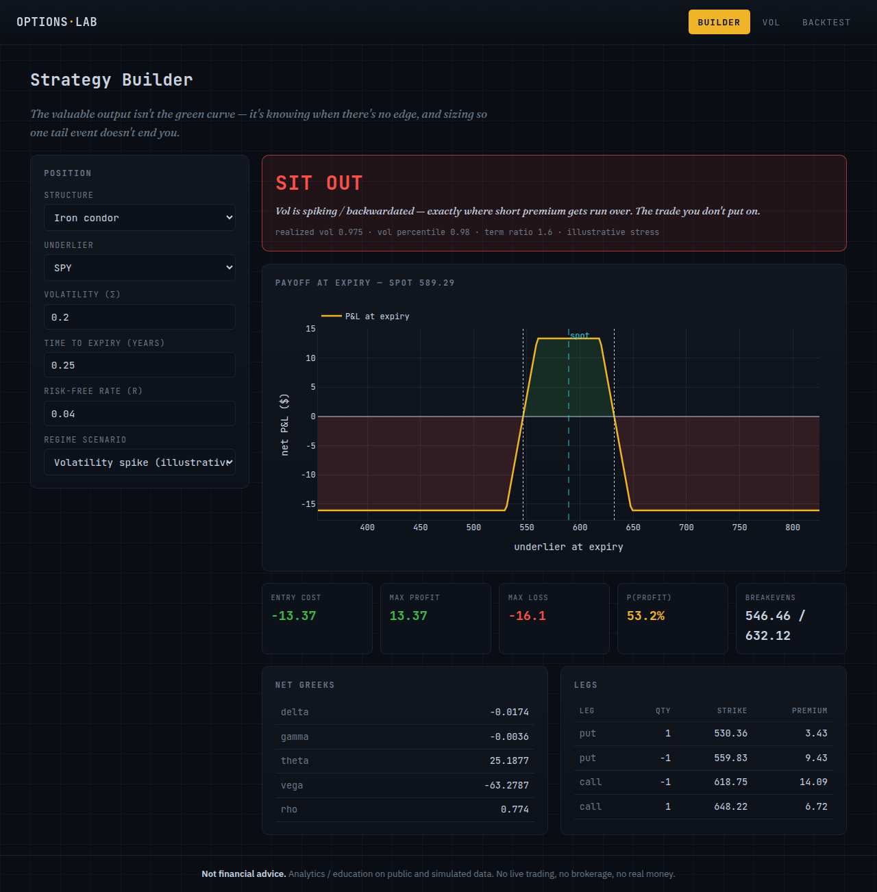
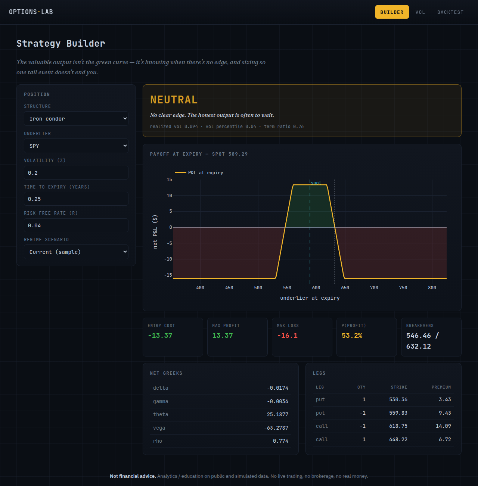
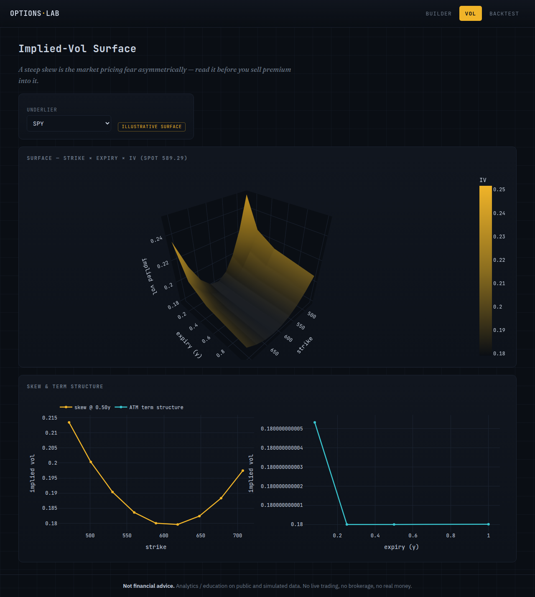
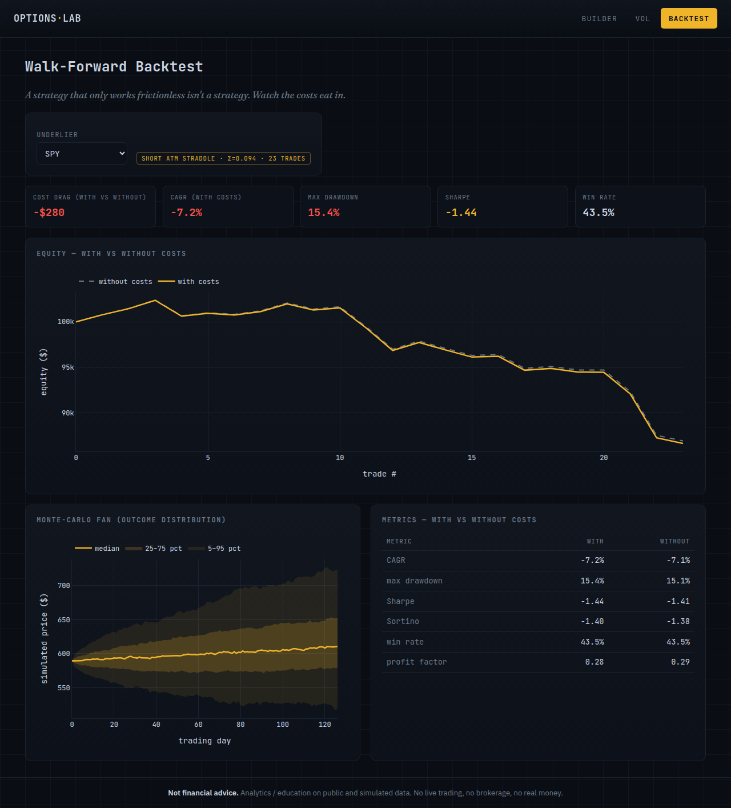

# Options Lab

An equities-and-options strategy studio — payoff, Greeks, IV surface, and an honest walk-forward + Monte-Carlo backtest — built to show the trade you *decided not to put on*, not just a green equity curve.

**▶ Live demo: [options-lab.onrender.com](https://options-lab.onrender.com)** &nbsp;·&nbsp; (free tier — first load after idle takes ~30–60s to wake)

> **Not financial advice.** Analytics / education tool on public + simulated data. No live trading, no brokerage, no real money, no personal account data.

Part of [hector-garza.com](https://hector-garza.com)'s portfolio. One of **three equal deliverables**: the app, a **Decision Record** ([`DECISIONS.md`](./DECISIONS.md)), and a recorded whiteboard session. A working demo no longer proves competence — the judgment behind it does. See [`SPEC.md`](./SPEC.md) §0.

> *"The valuable output isn't the green curve — it's knowing when there's no edge, and sizing so one tail event doesn't end you."*

---

## The judgment hook — "sit out"

Most retail tools sell a strategy with a green equity curve and hide the regime where the edge evaporates. Options Lab makes the *decision process* legible: a volatility-regime filter, defined a priori, that can return **SIT OUT** — the trade you don't put on.



## Screens

| Builder | Vol | Backtest |
|---|---|---|
|  |  |  |

- **Builder** — assemble a multi-leg position (covered call, vertical, straddle, strangle, iron condor) → payoff diagram, net Greeks, breakevens, max profit/loss, P(profit), and the regime verdict.
- **Vol** — implied-vol surface (strike × expiry), skew, and term structure. Labeled illustrative where it rests on a Black-Scholes reconstruction.
- **Backtest** — walk-forward equity **with vs. without costs**, drawdown/metrics, and a Monte-Carlo fan of outcomes. Watch the costs eat in.

## What it does

- Multi-leg payoff, breakevens, max profit/loss, lognormal P(profit).
- Net **Greeks** (delta/gamma/theta/vega/rho); implied-vol **surface**, skew, term structure.
- A **regime filter** that can say *"sit out."*
- **Walk-forward + Monte-Carlo backtest** with an explicit cost model and a with/without-costs toggle.
- Risk-based position sizing (tail-survival, not growth-max; capped Kelly, never full).

## Quickstart

One command (Docker) — serves at <http://localhost:8000>:

```bash
docker compose up --build      # or: make run
```

Local (no Docker):

```bash
pip install -r requirements-dev.txt
python manage.py runserver     # http://localhost:8000
pytest                         # run the test suite
ruff check .                   # lint
```

The demo runs offline: it ships seeded **simulated** sample bars (`lab/data/sample/`, labeled illustrative) and falls back to them if a live `yfinance` fetch is unavailable. No API keys — yfinance is keyless.

## Architecture

A pure, framework-free quant core with Django as a thin view layer over it:

```
lab/
├── pricing/    Black-Scholes price + analytic Greeks
├── vol/        implied-vol solver, surface, skew, term structure
├── strategy/   multi-leg payoff / breakevens / net Greeks / presets
├── backtest/   metrics, cost model, Monte Carlo, reconstruction engine, walk-forward
├── regime/     a-priori volatility verdict (favorable / neutral / sit-out)
├── sizing/     fixed-fractional + capped/fractional Kelly
├── data/       yfinance fetch + on-disk cache + offline sample
├── studio.py   orchestration the views call · charts.py  Plotly figures
└── views.py    thin Django views → templates (HTMX + Plotly)
```

The quant core never imports Django; it's deterministic and built **test-first**. Golden invariants are enforced by tests: put-call parity, IV round-trip, *costs always reduce net return*, capped Kelly never goes full, and the regime filter does emit "sit out."

## Tech stack

- **Backend:** Django (views over framework-free quant modules)
- **Quant:** NumPy / SciPy / pandas; `yfinance` for historical bars
- **Frontend:** Django templates + HTMX + Plotly
- **Packaging:** Docker · **Quality:** pytest + ruff + GitHub Actions CI

## Data honesty

Free retail options chains are thin and delayed. Where real historical chains aren't available, option prices are **reconstructed from the underlier + a Black-Scholes vol assumption** — a single, labeled approximation (`backtest.engine.reconstruct_option_price`). It proves method, not a live edge. The IV surface in the demo is a constructed, labeled shape. See [`DECISIONS.md`](./DECISIONS.md).

## Deployment

Live on **Render** at [options-lab.onrender.com](https://options-lab.onrender.com), deployed from [`render.yaml`](./render.yaml) (Docker, health check at `/healthz`, `$PORT`-aware, no API keys). Optionally fronted by Cloudflare at `options.hector-garza.com`.

## Links

- 🔗 Live demo: <https://options-lab.onrender.com>
- 🧠 Decision record: [`DECISIONS.md`](./DECISIONS.md)
- 🎥 Whiteboard walkthrough: _TBD_

## License

[MIT](./LICENSE)
